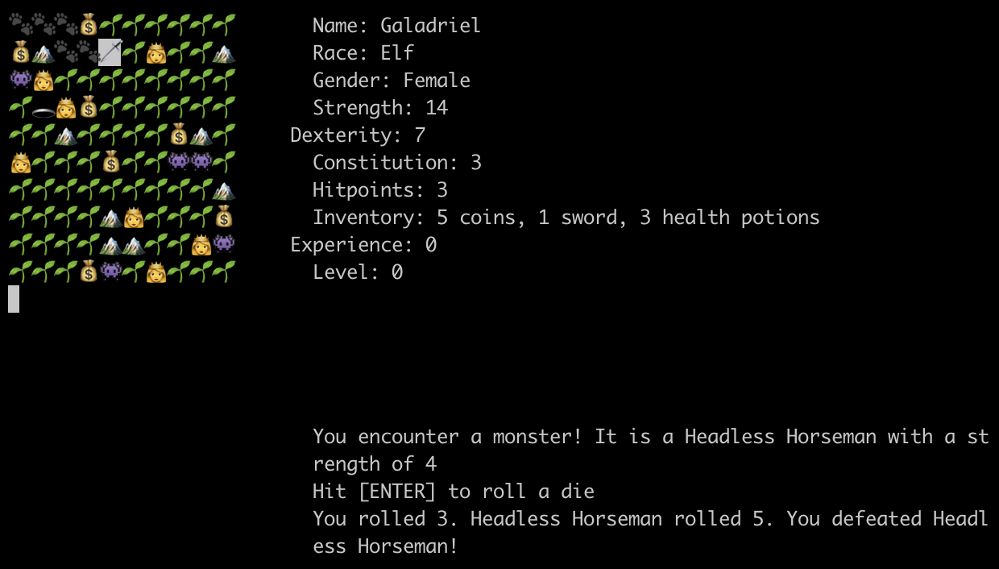

### Screenshots

### Prereqs

- Python 3.6.5+
- pipenv (setup `pipenv` (https://pypi.org/project/pipenv/) )

### Running

1. `pipenv install`
2. `make run`

### Testing

`make test`

### Styling
using `black` (https://github.com/python/black) to automatically format Python code. 

Run `make lint`  format python code.

### Troubleshooting

- If you see an error about a missing module, it is likely that someone else added it and now you need to install it in your pipenv. Just do `pipenv install` and you should be good to go.
